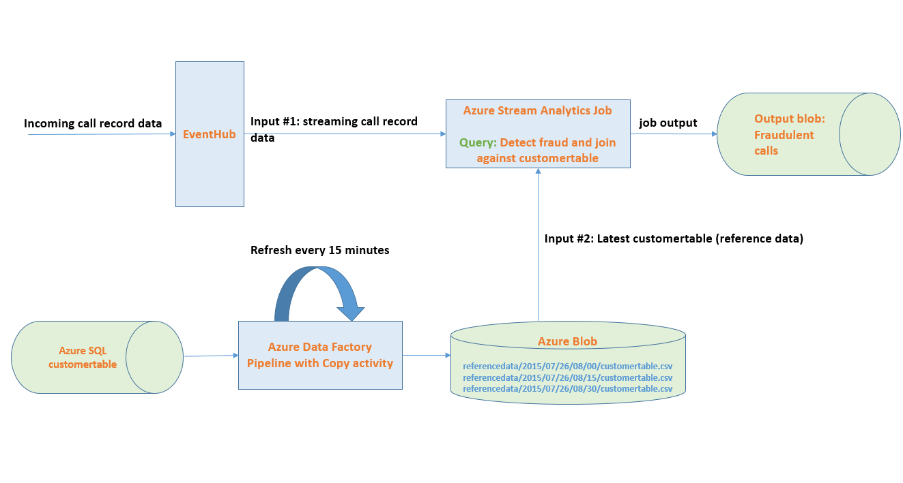

# Refreshing reference data with Azure Data Factory for Azure Stream Analytics Jobs #

Often times for your queries as part of your [stream analytics](https://azure.microsoft.com/en-us/documentation/services/stream-analytics/) jobs you want to join the incoming streaming time series data like device, sensor measurements with slow changing [“reference data”](https://azure.microsoft.com/en-us/documentation/articles/stream-analytics-key-concepts/#inputs) like device profile or  customer profile information. This enables you to create enhanced reports on insights generated by the stream job. This can for example allow you to slice anomalies detected by your stream jobs by the customers it is impacting. 

## Working with reference data with Stream Analytics ##

Stream analytics supports taking reference data stored in Azure blob storage as one of the [“inputs”](https://azure.microsoft.com/en-us/documentation/articles/stream-analytics-key-concepts/#inputs) for the job. To enable support for refreshing reference data the user needs to specify a list of blobs in the input configuration using the {date} and {time} tokens inside the path pattern. The job will load the corresponding blob based on the date and time encoded in the blob names using UTC time zone.

For example if the job has a reference input configured in the portal with the path pattern such as: /referencedata/{date}/{time}/customertable.csv where the date format is “YYYY/MM/DD” and the time format is “HH/mm” than the job will pick up a file named /referencedata/2015/07/26/08/30/customertable.csv at 8:30 AM on July 26th 2015 UTC time zone.

This requires the customers to address the following 2 challenges:

1. If your reference data is in a data store other than Azure blob you need to figure out how to move it to Azure blob.
1. While reference data changes relatively infrequently it still does change and you want to have a regular refresh schedule so that the reference data is picked up  and dropped in azure blob with the right path with datatime information as shown above.

## Refreshing reference data from a variety of data stores with Azure Data Factory ##

[Azure data factory](http://azure.microsoft.com/en-us/documentation/services/data-factory/) is the perfect solution for the above mentioned challenges. Data Factory is a cloud-based data integration service that orchestrates and automates the movement and transformation of data. Data factory supports [connecting to a large number of cloud based and on-premises data stores](https://azure.microsoft.com/en-us/documentation/articles/data-factory-data-movement-activities/) and moving data easily on a regular schedule your specify. 

Let’s take a concrete example. [Steam analytics get started guide](https://azure.microsoft.com/en-us/documentation/articles/stream-analytics-get-started/) shows a scenario for a telecommunication company where call records data is processed in a streaming fashion at scale and analyzed for SIM card fraud - multiple calls coming from the same identity around the same time but in geographically different locations. The stream analytics job for this scenario takes one input which is the streaming call records data coming in through eventhub. Now suppose we wanted to add another input – reference data with information about the customers (customerInfo table) like their name, contact information. This allows us to add a join against the customertInfo table in the streaming query that detects fraudulent calls to identify which customers are being affected by the fraud. Also suppose the customerInfo table is maintained in an Azure SQL database and can be updated multiple times during the day as new customers are added, contact information is changed etc. 

The diagram below shows the high level solution architecture leveraging data factory and stream analytics together to run the above mentioned query with reference data and setup the refresh for reference data on a schedule. 

As shown above you can create a data factory pipeline with copy activity which copies latest version of customertable from Azure SQL to blob in the corresponding path based on date & time information. The Azure stream analytics jobs is configured to take customertable as reference data input and always picks up the latest copy of the reference data as it becomes available. 

To learn more about the details of the solution follow the step by step walk through of setting up the sample.

## Step by Step Walk Through ##

### Setting up the ASA job for Telco Fraud Detection ###

